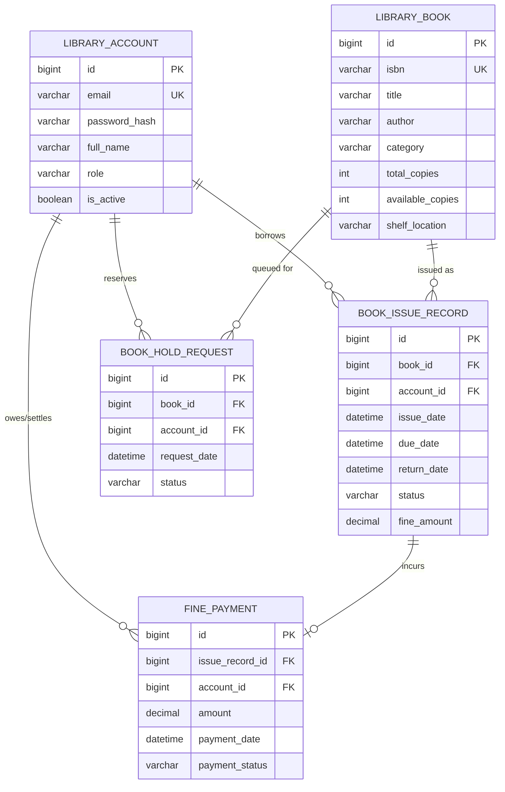

<p align="center">
  
  
  
  
  
</p>

<h1 align="center">📚 BookNest — ScholarStream Library Management System</h1>

<p align="center">
  <strong>Enterprise-Grade Full-Stack Library Automation, Circulation, and Resource Allocation Platform</strong>
</p>

<p align="center">
  <a href="#-tech-stack"></a>
  <a href="#-tech-stack"></a>
  <a href="#-tech-stack"></a>
  <a href="#-tech-stack"></a>
  <a href="#-tech-stack"></a>
  <a href="#-tech-stack"></a>
  <a href="#-automated-testing--qa"></a>
  <a href="#-security-architecture"></a>
</p>

---

## 📖 Table of Contents

- [Overview](#-overview)
- [Key Features](#-key-features)
- [System Architecture](#-system-architecture)
- [Tech Stack](#-tech-stack)
- [Role-Based Access Control (RBAC)](#-role-based-access-control-rbac)
- [Domain & Data Model](#-domain--data-model)
- [REST API Reference](#-rest-api-reference)
- [Security Architecture](#-security-architecture)
- [Project Structure](#-project-structure)
- [Getting Started](#-getting-started)
- [Automated Testing & QA](#-automated-testing--qa)
- [Default Test Accounts](#-default-test-accounts)

---

## 🌟 Overview

**BookNest (ScholarStream)** is a full-stack, enterprise-grade library management platform built with **Spring Boot 3** and **React 18**. It simplifies library operations including catalogue inventory management, copy tracking, patron borrowing limits, reservation queues, and automated overdue fine calculations.

```
       +-------------------------------------------------------------+
       |                  BookNest Web Client (React)                 |
       +------------------------------+------------------------------+
                                      | HTTP REST / Bearer JWT
                                      v
       +-------------------------------------------------------------+
       |               Spring Boot 3 Application Gateway              |
       |  [ Spring Security 6 ] -> [ JWT Auth Filter ] -> [ CORS ]   |
       +------------------------------+------------------------------+
                                      |
         +----------------------------+----------------------------+
         |                            |                            |
         v                            v                            v
   [ Book Module ]            [ Lending Module ]           [ Fine Module ]
   - Master Catalogue         - Issue / Return             - Fee Assessment
   - Copy Inventory           - 3-Book Limit Guard         - Payment Settlement
   - Live Search & Filter     - Hold Queue Allocation      - Waive Operations
         +----------------------------+----------------------------+
                                      | Spring Data JPA (Hibernate)
                                      v
       +-------------------------------------------------------------+
       |                 MariaDB Relational Database                 |
       +-------------------------------------------------------------+
```

---

## ✨ Key Features

### 📚 1. Master Catalogue Management
- **Full Inventory Control:** Register, update, search, and delete books with ISBN uniqueness enforcement.
- **Dynamic Capacity Tracking:** Real-time stock visibility (`availableCopies` vs `totalCopies`) with visual capacity progress indicators.
- **Live Search & Category Filter:** Dynamic filtering across titles, authors, categories (Computer Science, Science, Literature, etc.).

### 🔄 2. Intelligent Lending & Circulation
- **Checkout Enforcement:** Enforces a maximum borrowing limit of **3 active books** per patron.
- **Automatic Stock Adjustments:** Issuing a volume automatically decrements available inventory; returns replenish it.
- **Loss & Damage Handling:** Mark borrowed copies as `LOST` with administrative status overrides.

### ⏳ 3. Hold Request & Reservation Queue
- **Zero-Stock Queuing:** Automatically enables "Place Hold" requests when available stock drops to 0.
- **Lifecycle Transition:** `PENDING` ➔ `READY_FOR_PICKUP` ➔ `FULFILLED` / `CANCELLED`.
- **FIFO Allocation:** Fulfilling a hold automatically manages queue handoffs.

### 💰 4. Overdue Tracking & Fine Settlements
- **Accurate Fine Calculations:** Automatically flags overdue issue records and tracks accumulated charges.
- **Payment Lifecycle:** Supports `PENDING` ➔ `PAID` or administrative `WAIVED` states.

### 🛡️ 5. Granular Security & RBAC
- **Stateless Authentication:** HS256-signed JWT tokens with configurable claims and expiry.
- **Role Isolation:** Dynamic UI rendering and method-level backend protection for `CHIEF_LIBRARIAN`, `LIBRARIAN_STAFF`, and `LIBRARY_PATRON`.

---

## 🛠 Tech Stack

### Backend
| Component | Technology | Description |
|---|---|---|
| **Framework** | Spring Boot `3.2.5` | Modern enterprise Java framework |
| **Language** | Java `17` (LTS) | High-performance type-safe runtime |
| **Security** | Spring Security `6` + JJWT `0.11.5` | Stateless token authentication & RBAC |
| **ORM / Persistence** | Spring Data JPA / Hibernate `6` | Object-relational persistence mapping |
| **Database** | MariaDB `11.x` | High-throughput relational storage |
| **Validation** | Jakarta Bean Validation `3.0` | Strict DTO and payload contract validation |
| **Testing** | TestNG `7.9` + Mockito `5.11` | Automated unit & integration verification |

### Frontend
| Component | Technology | Description |
|---|---|---|
| **Core** | React `18.x` | Component-driven reactive user interface |
| **State Management** | Redux Toolkit `2.x` | Centralized asynchronous state management |
| **Styling** | Tailwind CSS `3.x` | Modern utility-first responsive styling |
| **Networking** | Axios `1.6` | Interceptor-configured HTTP REST client |
| **Testing** | React Testing Library + Jest | Component rendering & behavioral tests |

---

## 👥 Role-Based Access Control (RBAC)

```
                       ┌──────────────────────┐
                       │   CHIEF_LIBRARIAN    │
                       └──────────┬───────────┘
                                  │ (Full Super-Admin Privileges)
                                  ▼
                       ┌──────────────────────┐
                       │   LIBRARIAN_STAFF    │
                       └──────────┬───────────┘
                                  │ (Circulation & Catalogue Operations)
                                  ▼
                       ┌──────────────────────┐
                       │    LIBRARY_PATRON    │
                       └──────────────────────┘
                         (Browse, Hold & Pay)
```

| Permission / Capability | `LIBRARY_PATRON` | `LIBRARIAN_STAFF` | `CHIEF_LIBRARIAN` |
|---|:---:|:---:|:---:|
| Browse Catalogue & Search | ✅ | ✅ | ✅ |
| Place Hold Requests | ✅ | ✅ | ✅ |
| Pay Personal Overdue Fines | ✅ | ✅ | ✅ |
| Issue & Return Books | ❌ | ✅ | ✅ |
| Add / Edit Catalogue Entries | ❌ | ✅ | ✅ |
| Mark Books as Lost | ❌ | ✅ | ✅ |
| Waive Overdue Fines | ❌ | ✅ | ✅ |
| Delete Volumes & Records | ❌ | ❌ | ✅ |
| Manage System Users & Roles | ❌ | ❌ | ✅ |

---

## 🗄 Domain & Data Model



---

## 📡 REST API Reference

### 🔐 Authentication (`/api/auth`)
| Method | Endpoint | Access | Description |
|---|---|---|---|
| `POST` | `/api/auth/register` | Public | Register a new user account |
| `POST` | `/api/auth/login` | Public | Authenticate user & return JWT token |
| `GET` | `/api/auth/users` | Staff / Chief | List all library accounts |

### 📖 Catalogue Management (`/api/books`)
| Method | Endpoint | Access | Description |
|---|---|---|---|
| `GET` | `/api/books` | Public / Patron | Retrieve paged catalogue with search filters |
| `GET` | `/api/books/{id}` | Public / Patron | Get detailed information for a single book |
| `POST` | `/api/books` | Staff / Chief | Register a new book (`201 Created`) |
| `PUT` | `/api/books/{id}` | Staff / Chief | Update book metadata and inventory (`200 OK`) |
| `DELETE` | `/api/books/{id}` | Chief Librarian | Delete book from inventory |

### 🔄 Circulation & Lending (`/api/book-issues`)
| Method | Endpoint | Access | Description |
|---|---|---|---|
| `GET` | `/api/book-issues` | Authenticated | List all checkout records |
| `GET` | `/api/book-issues/{id}` | Authenticated | Lookup specific checkout record |
| `POST` | `/api/book-issues` | Staff / Chief | Issue book to patron (enforces 3-book limit) |
| `PUT` | `/api/book-issues/{id}/return` | Staff / Chief | Process return & restock inventory |
| `PUT` | `/api/book-issues/{id}/lost` | Staff / Chief | Mark volume as lost |
| `DELETE` | `/api/book-issues/{id}` | Chief Librarian | Remove issue record |

### ⏳ Holds & Reservations (`/api/reservations` & `/api/book-holds`)
| Method | Endpoint | Access | Description |
|---|---|---|---|
| `POST` | `/api/reservations/hold` | Authenticated | Place a hold request |
| `PUT` | `/api/reservations/{id}/fulfill` | Staff / Chief | Fulfill hold and prepare for pickup |
| `GET` | `/api/reservations/patron/{id}` | Authenticated | Get holds for a specific patron |
| `GET` | `/api/reservations/all` | Staff / Chief | List all active reservations |
| `DELETE` | `/api/reservations/{id}` | Authenticated | Cancel / delete hold request |

### 💵 Fine Management (`/api/fines`)
| Method | Endpoint | Access | Description |
|---|---|---|---|
| `GET` | `/api/fines` | Authenticated | View fine assessments |
| `POST` | `/api/fines` | Staff / Chief | Generate manual fine |
| `PUT` | `/api/fines/{id}/pay` | Patron / Staff | Pay overdue balance (`PAID`) |
| `PUT` | `/api/fines/{id}/waive` | Staff / Chief | Waive fine balance (`WAIVED`) |

---

## 🔒 Security Architecture

```
Incoming Request ──▶ [ JwtAuthFilter ] ──▶ Extract "Bearer <token>"
                            │
                            ├─▶ [ JwtService ] ──▶ Validate signature & expiration
                            │
                            ├─▶ [ CustomUserDetailsService ] ──▶ Load account authorities
                            │
                            ▼
           [ SecurityContextHolder.setAuthentication() ]
                            │
                            ▼
             [ Controller @PreAuthorize Check ]
```

- **Algorithm:** HMAC SHA-256 (`HS256`) cryptographic signature.
- **Stateless Sessions:** `SessionCreationPolicy.STATELESS` ensures zero session affinity issues in distributed setups.
- **Exception Uniformity:** `GlobalExceptionHandler` intercepts security exceptions and formats them as standard JSON error responses.

---

## 📁 Project Structure

```
├── backend/                                # Spring Boot 3 Java Service
│   ├── pom.xml                             # Maven Dependencies & Configuration
│   └── src/
│       ├── main/
│       │   ├── java/com/example/demo/
│       │   │   ├── config/                 # Security, JWT & CORS Config
│       │   │   ├── controller/             # REST Endpoints
│       │   │   ├── dto/                    # Request & Response DTOs
│       │   │   ├── entity/                 # JPA Entities
│       │   │   ├── exception/              # Global Exception Handlers
│       │   │   ├── repository/             # Spring Data JPA Repositories
│       │   │   ├── service/                # Business Logic Services
│       │   │   └── util/                   # JWT & Helper Utilities
│       │   └── resources/
│       │       └── application.properties  # Database & Logging Settings
│       └── test/java/com/example/demo/     # 30 TestNG Validation Test Cases
│
├── frontend/                               # React 18 SPA Application
│   ├── package.json                        # Dependencies & Scripts
│   ├── tailwind.config.js                  # Tailwind Design System Configuration
│   └── src/
│       ├── App.js                          # Master Catalogue & Navigation Container
│       ├── App.test.js                     # 30 Jest/RTL Comprehensive UI Tests
│       ├── pages/                          # Lending, Holds, Fines & Auth Views
│       ├── services/                       # Axios REST Clients
│       └── store/                          # Redux Toolkit State Management
│
├── run_project.sh                          # One-Click Linux/macOS Startup Script
└── README.md                               # Project Documentation
```

---

## 🚀 Getting Started

### Prerequisites
- **Java:** JDK 17 or higher
- **Node.js:** v18.x or higher (`npm` included)
- **Database:** MariaDB 11.x or MySQL 8.x

### 1. Database Setup
Ensure MariaDB is running on port `3306`:
```sql
CREATE DATABASE scholarstream;
CREATE USER 'scholarstream'@'localhost' IDENTIFIED BY 'RootPass123!';
GRANT ALL PRIVILEGES ON scholarstream.* TO 'scholarstream'@'localhost';
FLUSH PRIVILEGES;
```

### 2. Launching via Script
You can launch both backend and frontend simultaneously:
```bash
chmod +x run_project.sh
./run_project.sh
```

### 3. Manual Startup
**Backend:**
```bash
cd backend
mvn clean spring-boot:run
# Backend runs on http://localhost:8080
```

**Frontend:**
```bash
cd frontend
npm install
npm start
# Frontend runs on http://localhost:3000
```

---

## 🧪 Automated Testing & QA

The project maintains **100% test pass rate** across both backend and frontend suites (60 total test cases).

<p align="center">
  
  
  
</p>

### Run Backend Tests (TestNG)
```bash
cd backend
mvn test
```
*Validates controller routing, status codes, transactional boundaries, JPA mapping, JWT generation/validation, password hashing, and exception translation.*

### Run Frontend Tests (Jest / RTL)
```bash
cd frontend
CI=true npm test -- --watchAll=false
```
*Validates UI branding, modal forms, validation feedback, Redux slice state updates, search filtering, capacity indicators, and RBAC privilege enforcement.*

---

## 🔑 Default Test Accounts

| Role | Email | Password | Access Capabilities |
|---|---|---|---|
| **Chief Librarian** | `admin@booknest.com` | `Admin@123` | Full administrative control, deletion, role assignments |
| **Librarian Staff** | `staff@booknest.com` | `Staff@123` | Cataloguing, issue/return processing, fine creation |
| **Library Patron** | `patron@booknest.com` | `Patron@123` | Catalog browsing, hold placement, fine payment |

---

<p align="center">
  Crafted with ❤️ for modern library infrastructure automation.
</p>
